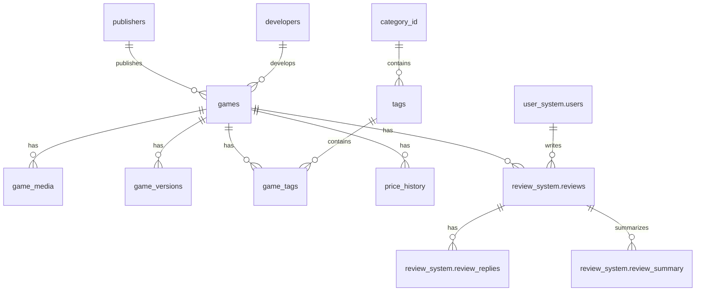

# Steam Website 数据库开发规范

## 1. 数据库设计规范

### 1.1 命名规范

#### 表命名
- 使用小写字母
- 单词间使用下划线分隔
- 使用名词复数形式
- 示例：`game_categories`, `user_profiles`

#### 字段命名
- 使用小写字母
- 单词间使用下划线分隔
- 主键统一使用 `id`
- 外键格式：`表名单数_id`
- 创建时间：`created_at`
- 更新时间：`updated_at`
- 删除标记：`is_deleted`

### 1.2 字段类型规范

```sql
-- 主键
id BIGSERIAL PRIMARY KEY

-- 字符串
short_text VARCHAR(255)    -- 短文本
long_text TEXT            -- 长文本

-- 数值
price DECIMAL(10,2)       -- 金额
quantity INTEGER          -- 数量
status SMALLINT          -- 状态码

-- 时间
created_at TIMESTAMP WITH TIME ZONE DEFAULT CURRENT_TIMESTAMP
updated_at TIMESTAMP WITH TIME ZONE DEFAULT CURRENT_TIMESTAMP

-- 布尔
is_active BOOLEAN DEFAULT true
```

## 2. 索引规范

### 2.1 索引命名
```sql
-- 主键索引
pk_表名

-- 唯一索引
uk_表名_字段名

-- 普通索引
idx_表名_字段名

-- 联合索引
idx_表名_字段1_字段2
```

### 2.2 索引使用规范
```sql
-- 必须建立索引的场景
1. 主键
2. 外键关联字段
3. 经常用于查询条件的字段
4. 经常用于排序的字段
5. 经常用于分组的字段

-- 索引示例
CREATE INDEX idx_games_title ON games(title);
CREATE INDEX idx_user_activities_created_at ON user_activities(created_at);
```

## 3. 触发器规范

### 3.1 触发器命名
```sql
-- 格式：trg_表名_动作_时机
trg_orders_update_timestamp_before_update
trg_games_check_price_before_insert
```

### 3.2 触发器模板
```sql
CREATE OR REPLACE FUNCTION update_timestamp()
RETURNS TRIGGER AS $$
BEGIN
    NEW.updated_at = CURRENT_TIMESTAMP;
    RETURN NEW;
END;
$$ LANGUAGE plpgsql;

CREATE TRIGGER trg_games_update_timestamp
    BEFORE UPDATE ON games
    FOR EACH ROW
    EXECUTE FUNCTION update_timestamp();
```

## 4. 存储过程规范

### 4.1 存储过程命名
```sql
-- 格式：sp_动作_对象
sp_get_user_games
sp_update_order_status
```

### 4.2 存储过程模板
```sql
CREATE OR REPLACE PROCEDURE sp_get_user_games(
    p_user_id BIGINT,
    p_limit INTEGER DEFAULT 10,
    p_offset INTEGER DEFAULT 0
)
LANGUAGE plpgsql
AS $$
BEGIN
    -- 参数验证
    IF p_user_id IS NULL THEN
        RAISE EXCEPTION 'User ID cannot be null';
    END IF;

    -- 业务逻辑
    RETURN QUERY
    SELECT g.*
    FROM games g
    JOIN user_games ug ON g.id = ug.game_id
    WHERE ug.user_id = p_user_id
    LIMIT p_limit
    OFFSET p_offset;
END;
$$;
```

## 5. 数据库关系规范

### 5.1 外键关系
```sql
-- 外键定义模板
ALTER TABLE child_table
ADD CONSTRAINT fk_child_parent
FOREIGN KEY (parent_id)
REFERENCES parent_table(id)
ON DELETE RESTRICT
ON UPDATE CASCADE;

-- 示例
ALTER TABLE user_games
ADD CONSTRAINT fk_user_games_user
FOREIGN KEY (user_id)
REFERENCES users(id)
ON DELETE RESTRICT
ON UPDATE CASCADE;
```

### 5.2 关系类型规范
- 一对一关系：使用相同主键或唯一外键
- 一对多关系：在"多"的一方建立外键
- 多对多关系：使用中间表，并建立复合主键

## 6. 性能优化规范

### 6.1 查询优化
```sql
-- 推荐写法
SELECT g.id, g.title, c.name as category_name
FROM games g
LEFT JOIN categories c ON g.category_id = c.id
WHERE g.status = 1
LIMIT 20 OFFSET 0;

-- 避免使用
SELECT *
FROM games
WHERE title LIKE '%keyword%'

-- 游戏基本信息查询优化示例
CREATE INDEX idx_games_basic_info ON games (
    game_id,
    current_price,
    discount,
    developer_id,
    release_date,
    player_count
) WHERE deleted_at IS NULL;

-- 标签关联查询优化
CREATE INDEX idx_game_tags_lookup ON game_tags (
    game_id,
    tag_id
);
```

### 6.2 索引优化
```sql
-- 联合索引最左原则
CREATE INDEX idx_games_category_status_created
ON games(category_id, status, created_at);

-- 覆盖索引
CREATE INDEX idx_games_list
ON games(id, title, price, category_id)
INCLUDE (description);
```

### 6.3 缓存策略
```sql
-- 游戏基本信息缓存键设计
game:basic:{game_id} = {
    game_id: xxx,
    current_price: xxx,
    discount: xxx,
    developer_name: xxx,
    release_date: xxx,
    player_count: xxx,
    tags: [...]
}

-- 缓存过期时间: 15分钟
EXPIRE game:basic:{game_id} 900
```

## 7. 安全规范

### 7.1 权限控制
```sql
-- 创建应用角色
CREATE ROLE app_user LOGIN PASSWORD 'xxx';

-- 授权
GRANT SELECT, INSERT, UPDATE ON games TO app_user;
GRANT USAGE ON SEQUENCE games_id_seq TO app_user;
```

### 7.2 数据加密
```sql
-- 敏感数据加密
CREATE EXTENSION pgcrypto;

-- 加密示例
UPDATE users
SET password = crypt('user_password', gen_salt('bf'));
```

## 8. 备份规范

### 8.1 备份策略
```bash
# 每日全量备份
pg_dump -Fc dbname > backup_$(date +%Y%m%d).dump

# 定期归档WAL日志
archive_command = 'cp %p /archive/%f'
```

### 8.2 恢复测试
```bash
# 恢复测试流程
pg_restore -d dbname backup.dump
```

## 9. 监控规范

### 9.1 性能监控
```sql
-- 慢查询监控
SELECT pid, query, query_start, state
FROM pg_stat_activity
WHERE state != 'idle'
AND (now() - query_start) > interval '5 seconds';
```

### 9.2 空间监控
```sql
-- 表空间监控
SELECT schemaname, tablename, pg_size_pretty(pg_total_relation_size(schemaname||'.'||tablename))
FROM pg_tables
ORDER BY pg_total_relation_size(schemaname||'.'||tablename) DESC;
```

## 10. 数据库表结构规范

### 10.1 核心表结构
```sql
-- 游戏表
CREATE TABLE games (
    game_id BIGSERIAL PRIMARY KEY,
    title VARCHAR(255) NOT NULL,
    slug VARCHAR(255) UNIQUE NOT NULL,
    description TEXT,
    short_description TEXT,
    publisher_id BIGINT REFERENCES publishers(publisher_id),
    developer_id BIGINT REFERENCES developers(developer_id),
    release_date TIMESTAMP WITH TIME ZONE,
    base_price DECIMAL(10,2),
    current_price DECIMAL(10,2),
    discount INTEGER,
    player_count VARCHAR(50),
    rating DECIMAL(3,2),
    status VARCHAR(50),
    language_support JSONB,
    system_requirements JSONB,
    created_at TIMESTAMP WITH TIME ZONE DEFAULT CURRENT_TIMESTAMP,
    updated_at TIMESTAMP WITH TIME ZONE DEFAULT CURRENT_TIMESTAMP,
    deleted_at TIMESTAMP WITH TIME ZONE
);

-- 用户表
CREATE TABLE user_system.users (
    user_id BIGSERIAL PRIMARY KEY,
    username VARCHAR(50) UNIQUE NOT NULL,
    email VARCHAR(255) UNIQUE NOT NULL,
    password_hash VARCHAR(255) NOT NULL,
    nickname VARCHAR(50),
    avatar_url TEXT,
    locale VARCHAR(10),
    timezone VARCHAR(50),
    account_status VARCHAR(20),
    role VARCHAR(20),
    created_at TIMESTAMP WITH TIME ZONE DEFAULT CURRENT_TIMESTAMP,
    updated_at TIMESTAMP WITH TIME ZONE DEFAULT CURRENT_TIMESTAMP,
    deleted_at TIMESTAMP WITH TIME ZONE
);

-- 评论表
CREATE TABLE review_system.reviews (
    review_id BIGSERIAL PRIMARY KEY,
    game_id BIGINT REFERENCES games(game_id),
    user_id BIGINT REFERENCES user_system.users(user_id),
    rating DECIMAL(3,2),
    content TEXT,
    playtime_hours INTEGER,
    likes_count INTEGER DEFAULT 0,
    review_status VARCHAR(20),
    is_recommended BOOLEAN,
    platform VARCHAR(20),
    language VARCHAR(10),
    created_at TIMESTAMP WITH TIME ZONE DEFAULT CURRENT_TIMESTAMP,
    updated_at TIMESTAMP WITH TIME ZONE DEFAULT CURRENT_TIMESTAMP,
    deleted_at TIMESTAMP WITH TIME ZONE
);
```

### 10.2 Schema规范
```sql
-- 用户系统Schema
CREATE SCHEMA user_system;

-- 评论系统Schema
CREATE SCHEMA review_system;
```

## 11. 视图规范

### 11.1 统计视图
```sql
CREATE VIEW v_database_stats AS
SELECT 
    schemaname,
    relname,
    n_live_tup AS row_count,
    pg_size_pretty(pg_total_relation_size(relid::regclass)) AS total_size
FROM pg_stat_user_tables;

CREATE VIEW game_overview_view AS
SELECT 
    g.game_id,
    g.description,
    g.rating,
    rs.positive_rate,
    rs.avg_playtime_hours,
    rs.total_reviews
FROM games g
LEFT JOIN review_system.review_summary rs ON g.game_id = rs.game_id
WHERE g.deleted_at IS NULL;
```

## 12. 分区表规范

### 12.1 按时间分区
```sql
-- 价格历史分区表
CREATE TABLE price_history (
    history_id BIGSERIAL,
    game_id BIGINT,
    price DECIMAL(10,2),
    start_time TIMESTAMP WITH TIME ZONE,
    end_time TIMESTAMP WITH TIME ZONE
) PARTITION BY RANGE (start_time);

-- 创建分区
CREATE TABLE price_history_2024_q1 PARTITION OF price_history
    FOR VALUES FROM ('2024-01-01') TO ('2024-04-01');
```

## 13. 安全规范

### 13.1 角色权限
```sql
-- 创建应用角色
CREATE ROLE app_readonly LOGIN PASSWORD 'xxx';
CREATE ROLE app_readwrite LOGIN PASSWORD 'xxx';

-- 授权
GRANT SELECT ON ALL TABLES IN SCHEMA public TO app_readonly;
GRANT SELECT, INSERT, UPDATE ON ALL TABLES IN SCHEMA public TO app_readwrite;
```

### 13.2 行级安全性
```sql
-- 启用行级安全性
ALTER TABLE user_system.users ENABLE ROW LEVEL SECURITY;

-- 创建策略
CREATE POLICY user_isolation_policy ON user_system.users
    USING (user_id = current_user_id());
```

## 14. 审计日志规范

### 14.1 审计表结构
```sql
CREATE TABLE audit_log (
    id BIGSERIAL PRIMARY KEY,
    table_name VARCHAR(50),
    operation VARCHAR(20),
    old_data JSONB,
    new_data JSONB,
    user_id BIGINT,
    timestamp TIMESTAMP WITH TIME ZONE DEFAULT CURRENT_TIMESTAMP
);
```

### 14.2 审计触发器
```sql
CREATE TRIGGER audit_games_changes
    AFTER INSERT OR UPDATE OR DELETE ON games
    FOR EACH ROW EXECUTE FUNCTION log_changes();
```

## 15. 数据库表关系图

### 15.1 核心表关系


## 16. 完整建表语句

### 16.1 游戏相关表
```sql
-- 开发商表
CREATE TABLE developers (
    developer_id BIGSERIAL PRIMARY KEY,
    developer_name VARCHAR(255) NOT NULL,
    founding_date DATE,
    headquarters VARCHAR(255),
    website VARCHAR(255),
    description TEXT,
    employee_count INTEGER,
    created_at TIMESTAMP WITH TIME ZONE DEFAULT CURRENT_TIMESTAMP,
    updated_at TIMESTAMP WITH TIME ZONE DEFAULT CURRENT_TIMESTAMP
);

-- 发行商表
CREATE TABLE publishers (
    publisher_id BIGSERIAL PRIMARY KEY,
    publisher_name VARCHAR(255) NOT NULL,
    founding_date DATE,
    headquarters VARCHAR(255),
    website VARCHAR(255),
    description TEXT,
    market_region TEXT[],
    created_at TIMESTAMP WITH TIME ZONE DEFAULT CURRENT_TIMESTAMP,
    updated_at TIMESTAMP WITH TIME ZONE DEFAULT CURRENT_TIMESTAMP
);

-- 游戏媒体表
CREATE TABLE game_media (
    media_id BIGSERIAL PRIMARY KEY,
    game_id BIGINT REFERENCES games(game_id),
    type VARCHAR(50),
    url TEXT NOT NULL,
    thumbnail_url TEXT,
    title VARCHAR(255),
    description TEXT,
    "order" INTEGER,
    created_at TIMESTAMP WITH TIME ZONE DEFAULT CURRENT_TIMESTAMP,
    updated_at TIMESTAMP WITH TIME ZONE DEFAULT CURRENT_TIMESTAMP,
    deleted_at TIMESTAMP WITH TIME ZONE
);

-- 游戏版本表
CREATE TABLE game_versions (
    version_id BIGSERIAL PRIMARY KEY,
    game_id BIGINT REFERENCES games(game_id),
    version_number VARCHAR(50),
    title VARCHAR(255),
    changelog TEXT,
    size BIGINT,
    is_public BOOLEAN DEFAULT true,
    release_date TIMESTAMP WITH TIME ZONE,
    created_at TIMESTAMP WITH TIME ZONE DEFAULT CURRENT_TIMESTAMP
);
```

### 16.2 分类和标签表
```sql
-- 分类表
CREATE TABLE category_id (
    category_id BIGSERIAL PRIMARY KEY,
    name VARCHAR(50) UNIQUE NOT NULL,
    code VARCHAR(50) UNIQUE NOT NULL,
    description TEXT,
    status VARCHAR(20) DEFAULT 'active',
    created_at TIMESTAMP WITH TIME ZONE DEFAULT CURRENT_TIMESTAMP,
    updated_at TIMESTAMP WITH TIME ZONE DEFAULT CURRENT_TIMESTAMP,
    deleted_at TIMESTAMP WITH TIME ZONE
);

-- 标签表
CREATE TABLE tags (
    tag_id BIGSERIAL PRIMARY KEY,
    category_id BIGINT REFERENCES category_id(category_id),
    name VARCHAR(50) NOT NULL,
    slug VARCHAR(50) UNIQUE NOT NULL,
    type VARCHAR(20),
    description TEXT,
    is_featured BOOLEAN DEFAULT false,
    created_at TIMESTAMP WITH TIME ZONE DEFAULT CURRENT_TIMESTAMP,
    updated_at TIMESTAMP WITH TIME ZONE DEFAULT CURRENT_TIMESTAMP,
    UNIQUE(category_id, name)
);

-- 游戏标签关联表
CREATE TABLE game_tags (
    game_id BIGINT REFERENCES games(game_id),
    tag_id BIGINT REFERENCES tags(tag_id),
    relevance INTEGER DEFAULT 100,
    created_at TIMESTAMP WITH TIME ZONE DEFAULT CURRENT_TIMESTAMP,
    PRIMARY KEY (game_id, tag_id)
);
```

### 16.3 评论系统表
```sql
-- 评论汇总表
CREATE TABLE review_system.review_summary (
    summary_id BIGSERIAL PRIMARY KEY,
    game_id BIGINT UNIQUE REFERENCES games(game_id),
    total_reviews INTEGER DEFAULT 0,
    average_rating DECIMAL(3,2),
    total_playtime_hours INTEGER DEFAULT 0,
    total_likes INTEGER DEFAULT 0,
    total_replies INTEGER DEFAULT 0,
    replies_likes INTEGER DEFAULT 0,
    pc_count INTEGER DEFAULT 0,
    ps5_count INTEGER DEFAULT 0,
    xbox_count INTEGER DEFAULT 0,
    en_us_count INTEGER DEFAULT 0,
    en_gb_count INTEGER DEFAULT 0,
    zh_cn_count INTEGER DEFAULT 0,
    es_es_count INTEGER DEFAULT 0,
    ja_jp_count INTEGER DEFAULT 0,
    recommended_count INTEGER DEFAULT 0,
    last_updated TIMESTAMP WITH TIME ZONE DEFAULT CURRENT_TIMESTAMP,
    positive_rate DECIMAL(5,2),
    avg_playtime_hours DECIMAL(10,2)
);

-- 评论回复表
CREATE TABLE review_system.review_replies (
    reply_id BIGSERIAL PRIMARY KEY,
    review_id BIGINT REFERENCES review_system.reviews(review_id),
    user_id BIGINT REFERENCES user_system.users(user_id),
    parent_id BIGINT REFERENCES review_system.review_replies(reply_id),
    content TEXT NOT NULL,
    likes_count INTEGER DEFAULT 0,
    reply_status VARCHAR(20) DEFAULT 'active',
    language VARCHAR(10),
    created_at TIMESTAMP WITH TIME ZONE DEFAULT CURRENT_TIMESTAMP,
    updated_at TIMESTAMP WITH TIME ZONE DEFAULT CURRENT_TIMESTAMP,
    deleted_at TIMESTAMP WITH TIME ZONE
);
```

## 17. 性能优化指南

### 17.1 查询优化
```sql
-- 1. 使用EXPLAIN ANALYZE分析查询计划
EXPLAIN ANALYZE
SELECT g.*, rs.average_rating
FROM games g
LEFT JOIN review_system.review_summary rs ON g.game_id = rs.game_id
WHERE g.status = 'active'
AND g.deleted_at IS NULL;

-- 2. 优化JOIN操作
-- 不推荐
SELECT * FROM games g
JOIN game_tags gt ON g.game_id = gt.game_id
JOIN tags t ON gt.tag_id = t.tag_id;

-- 推荐
SELECT g.game_id, g.title, t.name
FROM games g
JOIN game_tags gt ON g.game_id = gt.game_id
JOIN tags t ON gt.tag_id = t.tag_id;

-- 3. 使用部分索引优化特定查询
CREATE INDEX idx_active_games ON games(game_id)
WHERE status = 'active' AND deleted_at IS NULL;

-- 4. 使用复合索引优化多条件查询
CREATE INDEX idx_games_price_status ON games(current_price, status)
WHERE deleted_at IS NULL;
```

### 17.2 性能监控
```sql
-- 1. 监控长时间运行的查询
SELECT pid, 
       now() - query_start as duration,
       query
FROM pg_stat_activity
WHERE state != 'idle'
AND now() - query_start > interval '5 seconds';

-- 2. 监控表大小和增长
SELECT schemaname, 
       relname, 
       pg_size_pretty(pg_total_relation_size(relid)) as total_size,
       pg_size_pretty(pg_relation_size(relid)) as table_size,
       pg_size_pretty(pg_total_relation_size(relid) - pg_relation_size(relid)) as index_size
FROM pg_catalog.pg_statio_user_tables
ORDER BY pg_total_relation_size(relid) DESC;

-- 3. 监控索引使用情况
SELECT schemaname, 
       relname, 
       indexrelname, 
       idx_scan, 
       idx_tup_read, 
       idx_tup_fetch
FROM pg_stat_user_indexes
ORDER BY idx_scan DESC;
```

## 18. 错误码体系

### 18.1 数据库错误码
```sql
-- 自定义错误码
DO $$
BEGIN
    -- 数据完整性错误 (23000-23999)
    RAISE EXCEPTION USING 
        ERRCODE = '23000',
        MESSAGE = '违反数据完整性约束';
        
    -- 权限错误 (42000-42999)
    RAISE EXCEPTION USING
        ERRCODE = '42000',
        MESSAGE = '权限验证失败';
        
    -- 业务逻辑错误 (50000-59999)
    RAISE EXCEPTION USING
        ERRCODE = '50000',
        MESSAGE = '业务规则验证失败';
END $$;
```

## 19. 变更管理

### 19.1 版本控制
```sql
-- 版本记录表
CREATE TABLE db_version_control (
    version_id BIGSERIAL PRIMARY KEY,
    version_number VARCHAR(50) NOT NULL,
    description TEXT,
    applied_at TIMESTAMP WITH TIME ZONE DEFAULT CURRENT_TIMESTAMP,
    applied_by VARCHAR(50),
    script_name VARCHAR(255),
    checksum VARCHAR(64),
    status VARCHAR(20)
);

-- 记录变更
INSERT INTO db_version_control (
    version_number,
    description,
    applied_by,
    script_name
) VALUES (
    'v1.0.0',
    '初始数据库结构',
    'system',
    'initial_schema.sql'
);
```

### 19.2 变更日志
```sql
-- 变更日志表
CREATE TABLE change_log (
    id BIGSERIAL PRIMARY KEY,
    change_number VARCHAR(50),
    description TEXT,
    type VARCHAR(20),
    script TEXT,
    checksum VARCHAR(64),
    installed_by VARCHAR(100),
    installed_on TIMESTAMP WITH TIME ZONE DEFAULT CURRENT_TIMESTAMP,
    execution_time INTEGER,
    status VARCHAR(20)
);
```

## 20. 数据库测试规范

### 20.1 连接池测试
```sql
-- 连接池健康检查
CREATE OR REPLACE FUNCTION check_pool_health()
RETURNS TABLE (
    active_connections INT,
    idle_connections INT,
    max_connections INT,
    connection_wait_time INTERVAL
) AS $$
BEGIN
    RETURN QUERY
    SELECT 
        count(*) FILTER (WHERE state = 'active'),
        count(*) FILTER (WHERE state = 'idle'),
        setting::int,
        max(now() - xact_start) FILTER (WHERE state = 'active')
    FROM pg_stat_activity, pg_settings
    WHERE name = 'max_connections';
END;
$$ LANGUAGE plpgsql;

-- 使用示例
SELECT * FROM check_pool_health();
```

### 20.2 性能测试
```sql
-- 查询性能测试
CREATE OR REPLACE PROCEDURE test_query_performance(
    p_query TEXT,
    p_iterations INT
) AS $$
DECLARE
    v_start_time TIMESTAMP;
    v_end_time TIMESTAMP;
    v_iteration INT;
BEGIN
    FOR v_iteration IN 1..p_iterations LOOP
        v_start_time := clock_timestamp();
        EXECUTE p_query;
        v_end_time := clock_timestamp();
        
        INSERT INTO query_performance_log (
            query_text,
            execution_time,
            iteration_number
        ) VALUES (
            p_query,
            v_end_time - v_start_time,
            v_iteration
        );
    END LOOP;
END;
$$ LANGUAGE plpgsql;
```

### 20.3 负载测试
```sql
-- 并发连接测试
CREATE OR REPLACE PROCEDURE test_concurrent_connections(
    p_num_connections INT
) AS $$
DECLARE
    v_connection_id INT;
BEGIN
    FOR v_connection_id IN 1..p_num_connections LOOP
        PERFORM pg_advisory_lock(v_connection_id);
        PERFORM pg_advisory_unlock(v_connection_id);
    END LOOP;
END;
$$ LANGUAGE plpgsql;